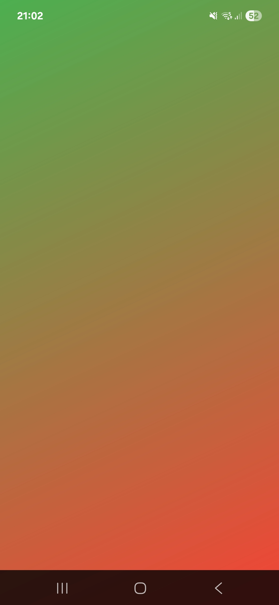
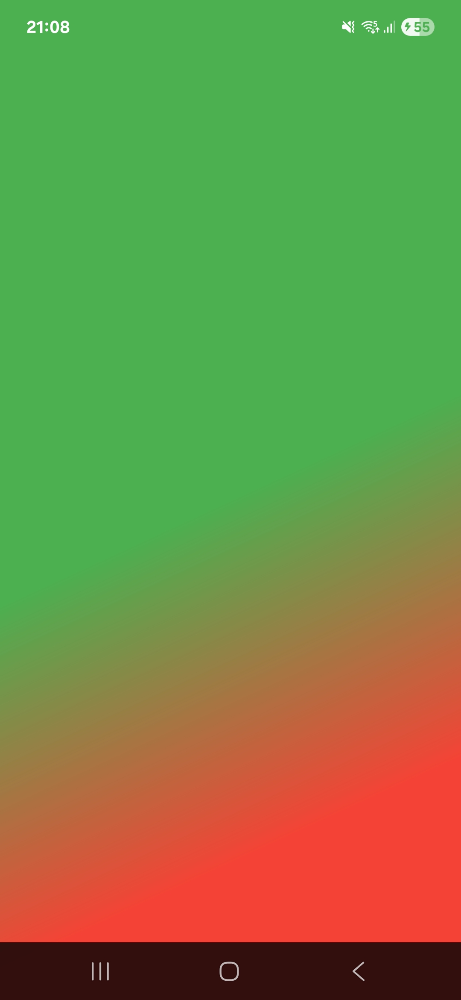

# How to use Gradients in flutter


### What is a gradient?
A gradient is a smooth transition between one or more colors. Instead of having a single color a gradient gradually blends one color into another creating a smooth and pleasant flow.  

Gradient are often used to build soft and modern and visually appealing UI's.

There are three types of gradients in flutter namely:  

1. Linear Gradient
2. Radial Gradient
3. Sweap Gradient

Now, lets see how each gradient  is been used

1. ## Linear Gradient

In a **Linear gradient**, the transition occurs along a straight line, either horizontal, vertical, or diagonal. Colors transition from one point to another along a straight path, that why its called "*Linear gradient*".

#### Implementation
1. Linear Gradient

```dart
LinearGradient(
    colors: [Colors.green, Colors.red],
    begin: Alignment.topLeft,
    end: Alignment.bottomRight,
)
```
You should see this:  



we also have ***stop*** that determines where each color starts and stops in the gradient line.

```dart
LinearGradient(
    colors: [Colors.green, Colors.red],
    begin: Alignment.topLeft,
    end: Alignment.bottomRight,
    start: [0.5, 0.8]
)
```
You should see this:
  
You notice the green colors extended a little to the bottom, thats because we extended its stop length, by default both colors are evenly districuted through out the gradient.
